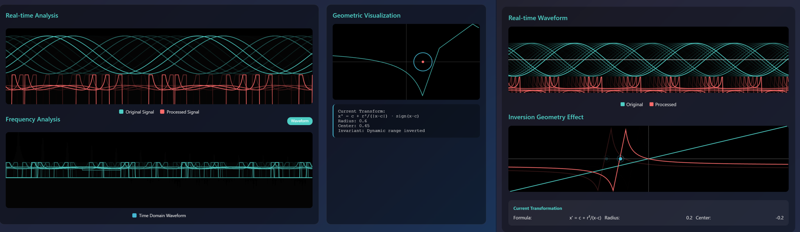

# Advanced Inversive Geometry Sound Laboratory

This application is an interactive, browser-based sound synthesis and processing tool that uses the principles of **inversive geometry** as its core engine for generating complex and novel sounds.

It is not a conventional synthesizer but an exploratory laboratory. Instead of manipulating oscillators and filters directly, users control the parameters of a geometric space. Sound is transformed based on its relationship to geometric objects and singularities within that space, leading to unique, dynamic, and often unpredictable sonic behaviors.

## Connection to Research

This application serves as the interactive demonstrator and proof-of-concept for the academic paper:

**"A Framework for Real-time Sonification of Inversive Geometry for Complex Sound Synthesis"**

The paper formalizes the underlying theory, details the sonification mapping framework, and discusses the potential of using abstract mathematical structures as a new paradigm for sound design and composition. This app allows researchers and practitioners to directly experience and verify the concepts discussed in the paper.

## Quick Start Guide

To start making sounds immediately:

1.  Click the **Initialize Audio** button.
2.  In the **Sound Sources** panel, ensure the `Source Type` is set to `Oscillator`.
3.  Click the **Play** button. You should hear a continuous tone.
4.  Now, go to the **Inversive Geometry** panel and begin manipulating the **Center** and **Radius** sliders.
5.  Listen as the sound transforms dramatically when you move the sliders. You have just controlled sound using geometry!

## Understanding the Interface

The laboratory is organized into several key areas:

### Modes of Operation

-   **Simple Mode:** The default view. Provides access to the most essential controls for immediate experimentation.
-   **Advanced Mode:** Unlocks additional parameters in each section, allowing for finer control over the geometric and synthesis algorithms.
-   **Soundscape Mode:** A compositional environment for layering multiple, independent instances of the geometric sound engine. Use the **Generative Presets** to explore its potential for creating evolving, complex textures.

### Control Sections

#### 1. Sound Sources
This panel determines the raw audio that will be fed into the geometric transformation engine.
-   **Source Type:** Choose from standard oscillators, noise, sample playback, or even real-time microphone input.
-   **Frequency/Waveform/Volume:** Standard controls for the selected source.
-   **Advanced Parameters:** Depending on the source, you can control harmonics, granular synthesis properties (grain size, density), and more.

#### 2. Inversive Geometry (The Core of the Lab)
This is where the magic happens. You are not changing the sound directly, but the rules of the space it inhabits.
-   **Algorithm:** Selects the core mathematical function used for the transformation.
    -   `Amplitude Inversion`: Applies the transformation directly to the waveform's amplitude.
    -   `Spectral Inversion`: Applies the transformation to the sound's frequency spectrum, warping its timbre.
    -   Others like `Möbius`, `Cardioid`, `Stereographic`: Each uses a different geometric rule, yielding unique sonic characteristics.
-   **Radius (`r`):** Controls the size of the "inversion circle." Sonically, this determines the overall intensity and area of effect. A small radius creates a localized, sharp effect, while a large radius creates a more global, subtle one.
-   **Center (`c`):** **This is the most critical control.** It defines the position of the geometric singularity—the point of maximum transformation. When the input signal's amplitude (or frequency, in Spectral mode) matches the `Center` value, the most dramatic sonic change occurs.
-   **Intensity:** A simple dry/wet control that blends the original sound with the transformed sound.

#### 3. Post-Processing
This panel contains standard audio effects that are applied *after* the geometric transformation.
-   **Spatial Processing:** Control the stereo field.
-   **Reverb, Delay, Filter:** Familiar effects to shape and place the sound in a virtual space.

### Visualizations

-   **Real-time Analysis:** Shows the original waveform (top, cyan) and the processed waveform (bottom, red) after it has passed through the geometric transformation. This is crucial for seeing how the geometry is affecting the sound's shape.
-   **Frequency Analysis:** A standard spectrum analyzer to visualize the timbre of the sound.
-   **Geometric Visualization:** A 2D representation of the inversion space, showing the inversion circle (blue) and the center point (red).

## Pro Tips for Exploration

-   **Finding the Singularity:** The most interesting sounds occur when the signal passes through the **Center (`c`)**. To explore this, start a simple sine wave playing. In the **Inversive Geometry** panel, set the **Radius** to a small value (e.g., 0.2) and **Intensity** to maximum (1.0). Now, **slowly** sweep the **Center** slider from `-1.0` to `1.0`. You will hear the precise point where the sound "shatters" or "tears"—this is the singularity in action.

-   **Timbral Warping:** To understand spectral inversion, select `Spectral Inversion` as the algorithm. Choose a harmonically rich source like a `Sawtooth` wave. Now, sweep the **Center** slider. You will hear the harmonic partials of the sound being bent and re-pitched around a central, unmoving frequency. This is a powerful way to create inharmonic, metallic timbres.

-   **Generative Soundscapes:** Don't build from scratch. In **Soundscape Mode**, click on the generative presets like `Ambient Space` or `Stellar Projection`. This will auto-populate the layers with carefully chosen parameters. Press **Play** and listen to how the independent geometric systems interact to create a complex, evolving whole.

-   **Interactive Rhythms:** Select `Granular Synthesis` as the source type. In the advanced parameters for the source, find the `Grain Inversion` and `Grain Radius` sliders. Now, click the pads (`C3`, `C4`, etc.) to trigger sounds while manipulating these two controls to geometrically alter the texture of the grains in real-time.

## Technical Notes

-   This application is built entirely with HTML, CSS, and vanilla JavaScript.
-   All audio processing is handled by the browser's native **Web Audio API**.
-   The current implementation uses the deprecated `ScriptProcessorNode` for rapid prototyping of the core DSP algorithms. A future version will migrate to `AudioWorklet` for improved performance and stability.

---

**Daniel Sandner**
*July 2025*